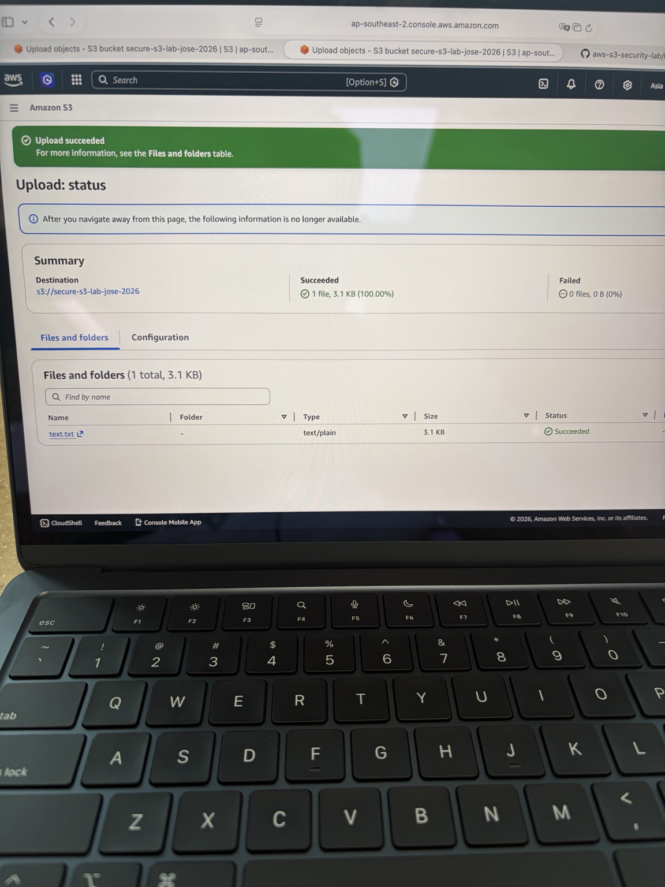
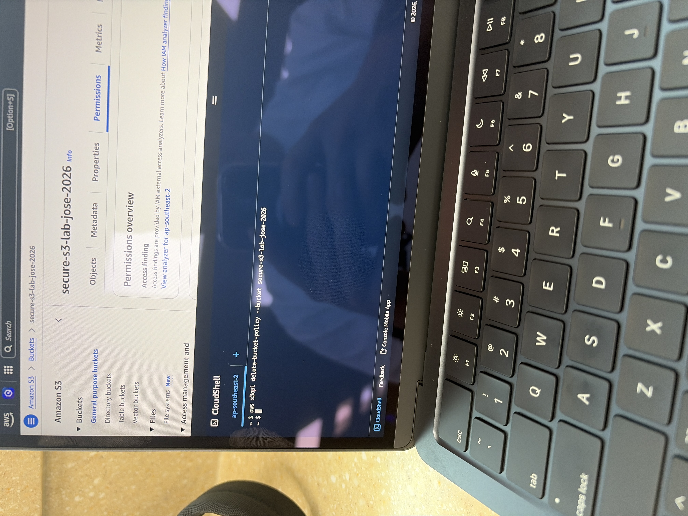

# AWS S3 Security Lab

## Overview
This project demonstrates how to securely configure an Amazon S3 bucket using encryption and access control policies.

## What I Implemented
- Created an S3 bucket in ap-southeast-2
- Enabled server-side encryption using AWS KMS (SSE-KMS)
- Configured a bucket policy to deny unencrypted uploads
- Tested upload failures without encryption and success with SSE-KMS
- Implemented IP-based access control and tested using a mobile hotspot
- Accidently locked myself out of the bucket and used AWS Cloudshell to regain access

## Tools Used
- Amazon S3
- AWS KMS
- IAM Policies
- AWS CloudShell

## Key Security Concepts
- Explicit Deny overrides all permissions
- Bucket policies can enforce encryption at upload
- Misconfigured policies can cause complete access lockout
- CloudShell can be used to recover access safely

## Screenshots
### Upload success

### CloudShell Recovery

